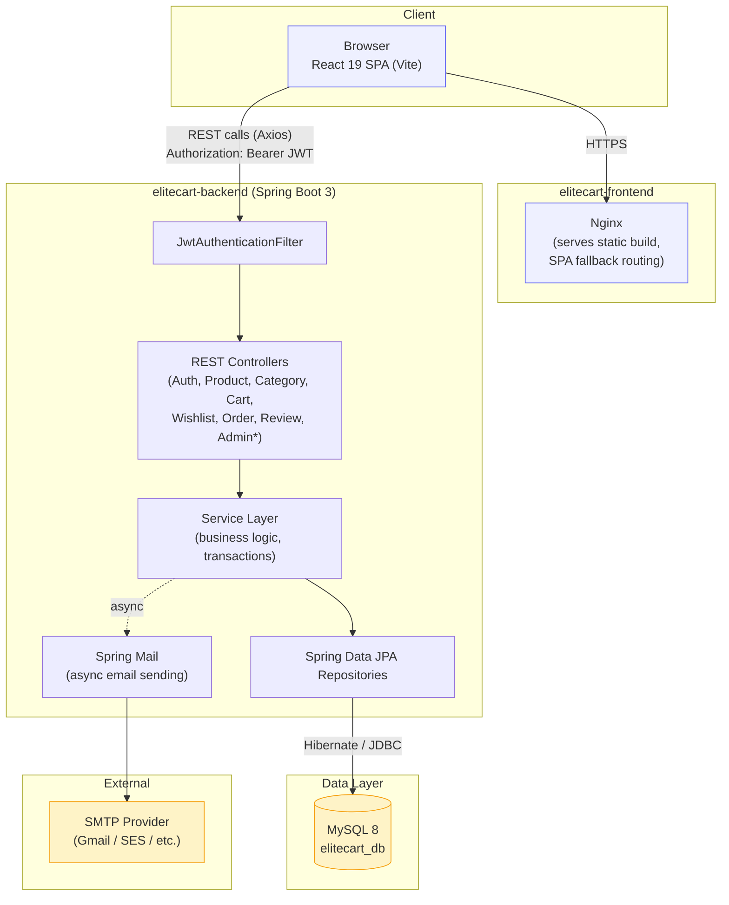
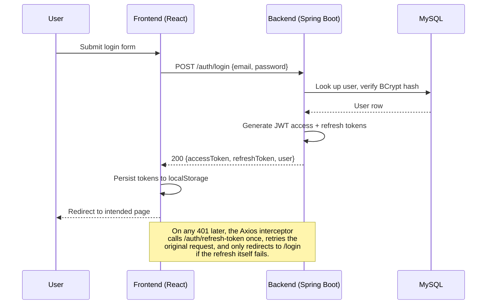
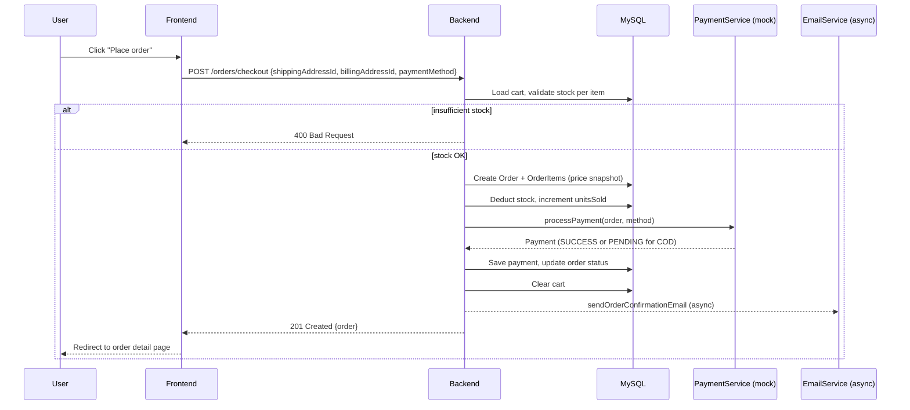

# EliteCart — System Architecture



## Request flow: authentication



## Request flow: checkout



## Layered architecture (per request)

```
Controller  →  validates input (Jakarta Validation), delegates to Service
    ↓
Service     →  business rules, transactions (@Transactional),
                orchestrates repositories + mappers + other services
    ↓
Repository  →  Spring Data JPA — no business logic, pure data access
    ↓
Database    →  MySQL, accessed via Hibernate
```

DTOs cross every boundary between Controller and Client — entities never
leave the Service layer. MapStruct (or hand-written mapper beans, where
composition across multiple mappers was clearer) convert entity ⇄ DTO in
both directions.
